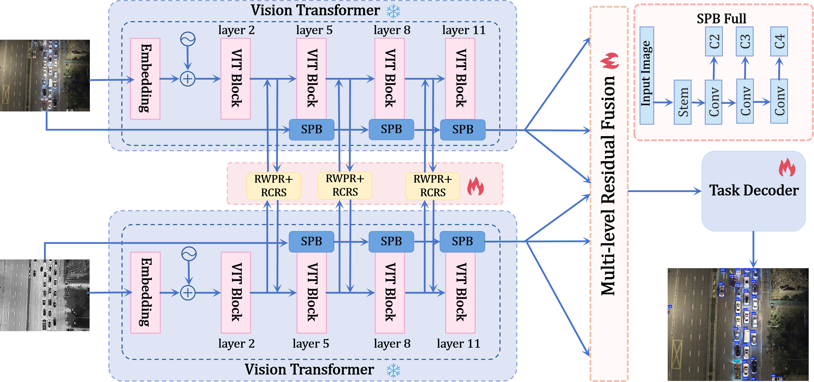

# registerMM

Official repository for **registerMM**.

> Code, checkpoints, and training scripts will be released after paper acceptance.

## Overview

This repository currently serves as a lightweight public project page for our ongoing work on multimodal object detection.

At this stage, we release:
- method overview figures
- selected qualitative visualizations
- project description

The full repository, including training code, inference code, checkpoints, and evaluation scripts, will be released after paper acceptance.

## Highlights

- Multimodal RGB-IR / RGB-Thermal object detection
- Dual-stream DINOv3S encoder
- RWPR-based cross-modal interaction
- RCRS refinement
- Residual-concat multi-scale fusion
- RG-PADI detail enhancement
- RT-DETR based detection head

## Method Overview

The current method overview figure is shown below.

## Qualitative Results

Selected qualitative results will be added under `assets/`.

## Repository Status

This repository is intentionally kept minimal for now.

Planned future release:
- [ ] training pipeline
- [ ] inference scripts
- [ ] checkpoints
- [ ] evaluation tools
- [ ] visualization scripts
- [ ] documentation and usage examples

## Paper

The manuscript is currently not publicly released.

A preprint and citation information will be added here once available.

## Code Release

To avoid confusion during the review and cleanup stage, the current public repository does not yet include the full implementation.

Please stay tuned for updates after paper acceptance.

## Contact

For questions or collaboration, please open an issue in this repository.
